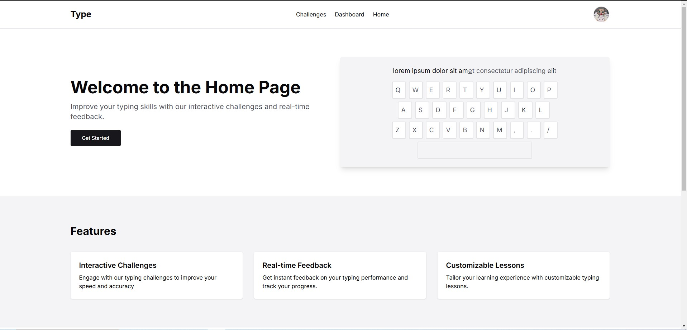
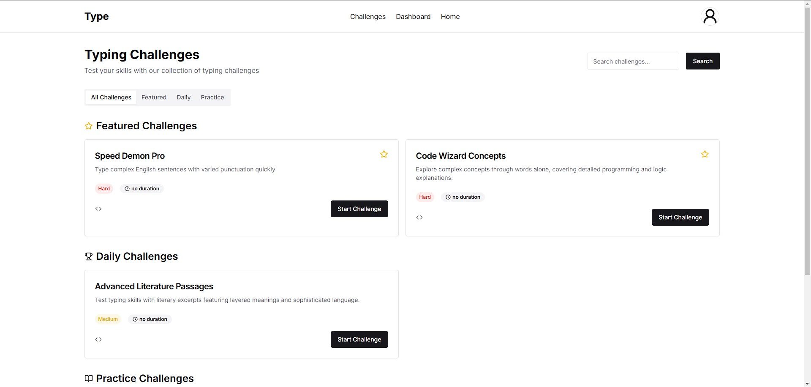

# TYPE-RACING ONLINE GAME

Welcome to the project!

## ABOUT
**TYPE-RACING ONLINE GAME** is an engaging web-based multiplayer typing challenge where players compete against each other in real-time to type passages of text as quickly and accurately as possible. Built with a monorepo architecture, this game uses **NestJS** for the backend and **React** for the frontend, making use of modern technologies like **Socket io** for real-time communication.

## Features
+ **Single-Player Mode:** Practice typing solo, aiming to beat personal records.
+ **Customizable Game Settings:** Modify text difficulty, game duration, and select different typing themes. (not implemented)
+ **Performance Stats & Analytics:** Track performance with stats, charts, and graphs.
+ **Achievements:** Earn and display badges for milestones like achieving a certain WPM.
+ **Profile:** User can see your information like challenges you recently take and your achievements.
+ **Settings:** You can customize your account info and also change certain settings for the website configurations.
+ **MultiFactor Authentication:** I also added MultiFA for better security.(you can activate it in the settings)
+ **Challenges:** You can brose challenges and search through it and there is also certain categories for it.
+ **Dashboard:** When you want to see your progress you will look at dashboard.

## SET UP

## DOCKER DEPLOYMENT
**NOTE:** if you are using docker as deployment (which are already setup in here) make sure to change the docker and static the backend

### to Clone
```bash
    git clone https://github.com/sheeshhhhhh/type-racing-game.git

```

### to install the dependencies in frontend
**FOR DEVELOPMENT**
Be in the root of the directory
```bash
    cd frontend
    npm install
```
### to install the dependencies in frontend
Be in the root of the directory
```bash
    cd backend
    npm install
```

### to run
Be in the root of the directory
you will need to terminal for this so make sure to split your terminal or make another one
```bash
    #terminal 1
    cd frontend
    npm run dev

    #terminal 2
    cd backend
    npm run start:dev
```

**Home**


**Dashboard**


**Profile**


**Challenges**


**Challenge Multiplayer**

